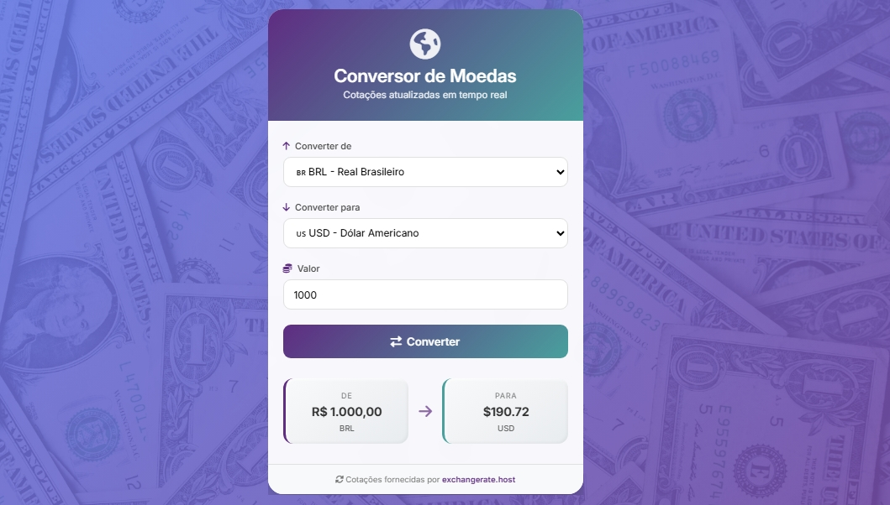

# 💱 Conversor de Moedas Elegante

![Preview do Projeto]

Um conversor de moedas moderno, responsivo e intuitivo, desenvolvido com HTML, CSS e JavaScript puro. O projeto consulte taxas de câmbio em tempo real para moedas fiduciárias e simula a cotação do Bitcoin para demonstração.

[](LICENSE)


---

## ✨ Funcionalidades

- **Conversão entre 5 moedas:** BRL, USD, EUR, GBP e BTC.
- **Taxas de câmbio atualizadas** via [Frankfurter API](https://www.frankfurter.app/) (para moedas fiduciárias).
- **Simulação de Bitcoin** com valores fixos (1 BTC ≈ 50.000 USD / 250.000 BRL).
- **Interface elegante:** gradientes, sombras, efeito vidro e ícones vetoriais.
- **Design responsivo** – se adapta a celulares, tablets e desktops.
- **Formatação automática** dos valores conforme o padrão de cada moeda (ex: R$ 1.000,00, US$ 1,000.00, ₿ 0,00002000).
- **Tratamento de erros** (falha na API, valores inválidos).

---

## 🚀 Tecnologias Utilizadas

- **HTML5** – Estrutura semântica.
- **CSS3** – Flexbox, gradientes, `backdrop-filter`, media queries e animações.
- **JavaScript (ES6+)** – Consumo de API com `fetch` e `async/await`, manipulação do DOM, formatação com `Intl.NumberFormat`.
- **[Font Awesome](https://fontawesome.com/)** – Ícones vetoriais.
- **[Google Fonts](https://fonts.google.com/)** – Fonte **Inter**.
- **[Frankfurter API](https://www.frankfurter.app/)** – API gratuita de taxas de câmbio.

---

## 📸 Screenshots

| Desktop | Mobile |
|---------|--------|
|  |  |



---

## 📡 API e Limitações

A Frankfurter API fornece taxas apenas para moedas fiduciárias e não inclui criptomoedas. Por isso, a cotação do Bitcoin foi simulada com constantes no código.

A API tem atualizações diárias (não é tempo real minuto a minuto), mas é suficiente para um conversor demonstrativo.

Em uma versão futura, pretendo integrar uma API específica de criptomoedas (ex: CoinGecko) para cotações reais de BTC.

---

## 📁 Estrutura do Projeto

conversor-moedas/
├── index.html          # Página principal
├── styles.css          # Estilos CSS
├── script.js           # Lógica JavaScript
├── README.md           # Documentação
└── screenshot.png      # Imagem de preview

---

## 🤝 Contribuição

Contribuições são sempre bem-vindas! Siga os passos:

Faça um fork do projeto.

Crie uma branch para sua feature (git checkout -b feature/AmazingFeature).

Commit suas mudanças (git commit -m 'Add some AmazingFeature').

Push para a branch (git push origin feature/AmazingFeature).

Abra um Pull Request.

---

## 📄 Licença
Distribuído sob a licença MIT. Veja LICENSE para mais informações.

---

## 🔧 Como Executar o Projeto

1. **Clone o repositório:**
   ```bash
   git clone https://github.com/seu-usuario/conversor-moedas.git
